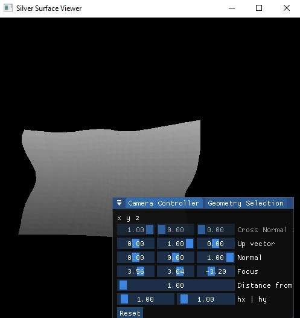

# Silver Project

The silver project is a collection of modules that provide a simple renderer for 3D surfaces.

# Dependencies
- C++ 20
- Git
- Vcpkg
- Cmake
- Visual Studio 2022

# How to contribute
Install all dependencies, clone the repo, and run:
```
git submodule init
git submodule update
```

Now you should be able to build and run silver modules on your computer.

# Little Preview

If you run from this project you should be able to see some surfaces under [`/assets`](./assets/) folder. Here is some example of the project running:

